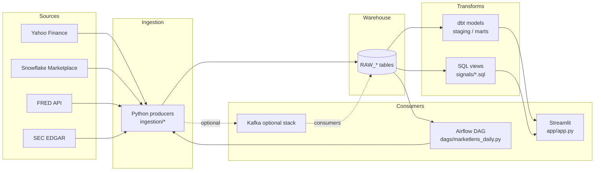

# MarketLens — data journey (onboarding)

This page is a **mental map** of how data moves through the project. It does not replace `README.md`; use it when you want a single narrative from **sources → warehouse → transforms → app / orchestration**.

## High-level flow

## Rough ordering in time (batch day)

1. **Airflow** triggers tasks in `dags/marketlens_daily.py` (weekday schedule).
2. **Producers** pull prices / macro / FRED / SEC (see `ingestion/`).
3. **Snowflake** stores raw rows (`RAW_STOCK_PRICES`, `RAW_MACRO_INDICATORS`, `RAW_FRED_INDICATORS`, SEC tables, etc.).
4. **dbt** and/or hand-maintained **SQL** build curated views (`V_*`) used by signals and the dashboard.
5. **Streamlit** reads `V_*` views via `app/snowflake_client.py` and renders pages.
6. **Notifications** may fire after anomaly checks (Slack / email), still orchestrated from the DAG path.

## Where to read code (suggested order)

| Step | Location |
|------|-----------|
| Orchestration | `dags/marketlens_daily.py` |
| Ingestion | `ingestion/yfinance_producer.py`, `fred_producer.py`, `sec_producer.py`, … |
| Config | `config.py`, `.env.example` |
| Warehouse DDL / bootstrap | `setup.sql`, `migrations/` |
| Transforms | `dbt/models/`, `signals/` |
| Dashboard | `app/app.py`, `app/snowflake_client.py` |
| Optional metrics | `reports/extra_metrics.py` (wired from `app.py` when non-empty) |

## Local tools (no pipeline side effects)

- `python scripts/pipeline_overview.py` — prints resolved config flags (no Snowflake connection).
- `queries/exploratory/*.sql` — manual Snowflake queries for learning.
