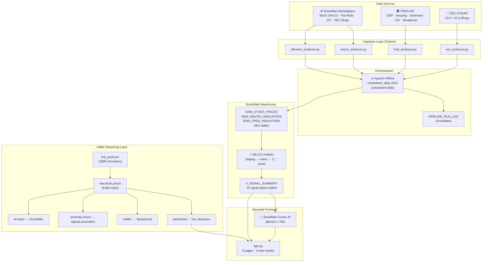

# MarketLens — Presentation Script & Slide Guide

**CSE-5114 · 15 min talk + 5 min Q&A**

---

> **⚠️ Draft — for reference only**
>
> This document is a starting point, not a final script. It is based on the current state of the codebase and each person's code contributions at the time of writing. The actual presentation, final report, and individual sections may look quite different — and that is expected.
>
> **Everyone is strongly encouraged to:**
>
> - Design their own slides their own way
> - Add topics, examples, or personal insights that are not listed here
> - Adjust the talking points to match how *they* would naturally explain their work
> - Expand any section that they feel deserves more depth
>
> The time allocations and segment order here are a rough starting structure. If you find a better flow or want to reorganize, go for it — just sync with the team beforehand so the transitions stay smooth.

---

## Speaker Assignments at a Glance


| Segment                                                                    | Speaker    | Time       |
| -------------------------------------------------------------------------- | ---------- | ---------- |
| Hook & motivation                                                          | Zihao      | 2 min      |
| Platform demo (video)                                                      | Zihao      | 2 min      |
| System overview + handoff                                                  | Zihao      | 0.5 min    |
| **Data sources** (Snowflake Marketplace, FRED API, SEC EDGAR)              | **Andrew** | **~1 min** |
| **Ingestion & orchestration** (4 producers, Airflow DAG, pipeline logging) | **Andrew** | **~1 min** |
| **dbt transformation layer** (13 models, staging → marts, quality tests)   | **Andrew** | **~1 min** |
| **Signal engineering** (10 signal types, RSI/MA/drawdown SQL, SEC NLP)     | **Andrew** | **~1 min** |
| Kafka streaming, LLM interface, frontend                                   | Zihao      | 3.5 min    |
| **What each metric means** (RSI, Z-score, yield curve, sentiment, GDP)    | **Zhuang** | **~1 min** |
| **User journey case study** (one event through 3 user lenses)             | **Zhuang** | **~1 min** |
| Future directions                                                          | Zihao      | 1 min      |
| **Total**                                                                  |            | **15 min** |


---

## Slide-by-Slide Breakdown

---

### SLIDE 1 — The Problem *(Zihao, ~1 min)*

**Headline:** *"The S&P 500 dropped 3% yesterday. What does that actually mean for you?"*

**Talking points:**

- Market data is everywhere — Reuters, CNBC, Bloomberg — but written entirely for professionals
- Bloomberg Terminal costs $24,000/year per seat; most people have no access
- Even when data is free (Yahoo Finance, FRED), it is raw numbers with no interpretation
- The real gap: no single tool that adapts its depth and language to *who is asking*
  - A student wants a plain-English story
  - An enthusiast wants trends and comparisons
  - An analyst wants Z-scores, RSI, drawdown percentages, and macro overlays

**Visual:** Split screen — left: overwhelming Bloomberg terminal screenshot; right: MarketLens landing page (clean, three modes)

---

### SLIDE 2 — Our Answer: MarketLens *(Zihao, ~1 min)*

**Headline:** *Same data. Three lenses.*

**Talking points:**

- MarketLens is a multi-source, AI-augmented market intelligence platform built on Snowflake
- Three user levels that share the same underlying data pipeline but serve completely different experiences:
  - 🌱 **Just Curious** — plain-English story, no jargon, everyday analogies
  - 📊 **Know the Basics** — gainers/losers, signal counts, AI-generated insights
  - 🎯 **Financial Analyst** — Z-scores, RSI, drawdown, yield curve, Kafka live feed
- Key design principle: *the platform should be as useful to a first-year student as to a data-driven analyst*

**Visual:** Screenshot of the redesigned landing page (dark theme, orbit animation, tech pill row, three mode cards with feature bullets)

---

### VIDEO DEMO *(Zihao, ~2 min)*

**What to show in order:**

1. Land on the home page — orbit animation, tech pills, live status dot
2. Click **Just Curious** → Story of the Day + market snapshot tiles (SPY/QQQ/AAPL)
3. Type a question: *"What is inflation?"* — show the plain-English LLM response
4. Go back → click **Know the Basics** → "What's Moving Today" leaderboard (gainers/losers)
5. Go back → click **Financial Analyst** → stats ribbon + signal heatmap + Stock Deep Dive header cards (RSI/MA/Drawdown)
6. Navigate to **Macro Overlay** → show 7 tabs (Fed Rate, CPI, Yield Curve, GDP, Housing, Sentiment, Inflation Expectations)
7. Navigate to **Live Feed** → Kafka prices auto-refreshing every 2 seconds
8. Toggle **Admin Mode** → show tech-stack explainer banners on each page

---

### SLIDE 3 — System Overview *(Zihao, 30 sec handoff)*

**Headline:** *Eight technologies. One pipeline.*

**Talking points:**

- Everything the demo showed is backed by a production-grade data pipeline
- Hand off to Andrew: *"Let Andrew walk you through how all this data actually gets in and gets transformed"*

**Figure — Full System Architecture (Mermaid):**




---

### SLIDE 4 — Data Sources *(Andrew, ~1 min)*

**Headline:** *Three completely free data sources. Zero licensing cost.*

**Talking points:**

**Snowflake Marketplace (free tier)** — accessed as native SQL views inside Snowflake, no API key, no rate limit, no egress cost:


| Marketplace Table                             | Series / Variables Used                                                                                                    | What It Gives Us                                                               | Update Cadence |
| --------------------------------------------- | -------------------------------------------------------------------------------------------------------------------------- | ------------------------------------------------------------------------------ | -------------- |
| `STOCK_PRICE_TIMESERIES`                      | `post-market_close_adjusted`, `pre-market_open_adjusted`, `all-day_high_adjusted`, `all-day_low_adjusted`, `nasdaq_volume` | Full OHLCV for 9 tickers (AAPL, MSFT, GOOGL, AMZN, TSLA, NVDA, META, SPY, QQQ) | Daily          |
| `FINANCIAL_ECONOMIC_INDICATORS_TIMESERIES`    | `EFFR_PCT` (effective Fed Funds rate)                                                                                      | Daily policy rate — core macro anchor                                          | Daily          |
| `BUREAU_OF_LABOR_STATISTICS_PRICE_TIMESERIES` | `CPI:_All_items,_Seasonally_adjusted,_Monthly`                                                                             | Headline inflation index                                                       | Monthly        |
| `SEC_CORPORATE_REPORT_TEXT_ATTRIBUTES`        | Form types: 10-K, 10-Q, 8-K                                                                                                | Full regulatory filing text for NLP                                            | Per filing     |


**FRED API (St. Louis Federal Reserve)** — free public REST API, implemented in `ingestion/fred_producer.py`:


| FRED Series ID | Variable Name       | Economic Meaning                            | Cadence   |
| -------------- | ------------------- | ------------------------------------------- | --------- |
| `GDPC1`        | Real GDP            | Inflation-adjusted output of the US economy | Quarterly |
| `HOUST`        | Housing Starts      | New residential construction units (SAAR)   | Monthly   |
| `UMCSENT`      | Consumer Sentiment  | UMich household confidence survey           | Monthly   |
| `DGS10`        | 10Y Treasury Yield  | Long-term risk-free rate benchmark          | Daily     |
| `T10YIE`       | Breakeven Inflation | Market-implied 10Y inflation expectation    | Daily     |


**SEC EDGAR** — free public HTTP API, implemented in `ingestion/sec_producer.py`:

- Fetches 10-K and 10-Q filings for each watchlist ticker
- Each filing is chunked into 6,000-character segments to stay within LLM context limits
- Snowflake Cortex summarizes each chunk into: `management_tone`, `revenue_narrative`, `guidance_narrative`, `risk_narrative`
- Up to 20 filings processed per pipeline run; results persisted to avoid redundant re-processing

> *More about data source choices Andrew can add here — e.g. why FRED over paid alternatives, what other Marketplace variables were considered, any data quality issues encountered ...*

---

### SLIDE 5 — Ingestion Architecture *(Andrew, ~1 min)*

**Headline:** *Four producers. One DAG. Everything logged to Snowflake.*

**Talking points — one row per producer:**


| Producer          | File                             | What it does                                                                                               | Output table                               | Key design detail                                                                          |
| ----------------- | -------------------------------- | ---------------------------------------------------------------------------------------------------------- | ------------------------------------------ | ------------------------------------------------------------------------------------------ |
| **Stock / Macro** | `ingestion/macro_producer.py`    | Queries `STOCK_PRICE_TIMESERIES` and `FINANCIAL_ECONOMIC_INDICATORS_TIMESERIES` via SQL; bulk-inserts rows | `RAW_STOCK_PRICES`, `RAW_MACRO_INDICATORS` | Bulk-load perf fix: batched inserts instead of row-by-row                                  |
| **FRED**          | `ingestion/fred_producer.py`     | Calls FRED REST API for 5 series; normalizes to `(DATE, VARIABLE, VALUE)` schema                           | `RAW_FRED_INDICATORS`                      | Retry logic with `tenacity`; skips gracefully if `FRED_API_KEY` is missing                 |
| **SEC EDGAR**     | `ingestion/sec_producer.py`      | Scrapes filing index, downloads HTML, strips tags, chunks text, calls Cortex for summary                   | `RAW_SEC_FILINGS`, `RAW_SEC_NARRATIVES`    | Circuit breaker pattern; respects EDGAR 10 req/s rate limit (0.11s sleep between requests) |
| **yfinance**      | `ingestion/yfinance_producer.py` | Fallback price source via Yahoo Finance when Marketplace is unavailable                                    | `RAW_STOCK_PRICES`                         | Used for real-time Kafka tick seeding                                                      |


**Apache Airflow DAG — `marketlens_daily`:**

```
[fetch_stock_prices]  ──────────────────────────────────────┐
[fetch_macro_indicators]  ──────────────────────────────────┤
[fetch_fred_indicators]   ──────────────────────────────────┼──► [check_anomalies] ──► [send_notifications]
[fetch_sec_filings]   ──────────────────────────────────────┘
         │
         ▼  (each task on completion)
  pipeline_logger.py
         │
         ▼
  PIPELINE_RUN_LOG (Snowflake)
  ┌────────────────────────────────────────────────────────┐
  │  RUN_ID · DAG_ID · TASK_ID · STATUS · ROW_COUNT       │
  │  STARTED_AT · COMPLETED_AT · DURATION_SEC · ERROR_MSG │
  └────────────────────────────────────────────────────────┘
  → visible on the Pipeline Health page in the app
```

**Scale numbers:**

- ~9 tickers × ~5 years of trading days ≈ 11,000+ price rows on first full load
- 5 FRED series at daily/monthly/quarterly cadence → hundreds of macro rows
- SEC: up to 20 filings/run × ~6,000-char chunks → ~120 segments per run
- On failure: Airflow retries automatically; Slack/email alert fires via `ingestion/notifier.py`

> *More about pipeline design Andrew can add here — e.g. handling weekends/holidays in price data, any tricky deduplication logic, how retries are configured, what happens when EDGAR is slow ...*

---

### SLIDE 6 — dbt Transformation Layer *(Andrew, ~1 min)*

**Headline:** *Raw rows become business-ready signals through 13 versioned SQL models.*

**What is dbt and why does it matter:**

- dbt (data build tool) is the standard way to manage SQL transformations in a modern data warehouse
- Every model is version-controlled, documented, and testable — not ad-hoc SQL scripts
- Models are organized in two layers: **staging** (clean and normalize) → **marts** (business logic and signals)
- Running `dbt run` rebuilds all views in dependency order automatically

**Staging models — one per raw source, normalize only:**


| Model                             | Reads from             | What it standardizes                                   |
| --------------------------------- | ---------------------- | ------------------------------------------------------ |
| `stg_stock_prices`                | `RAW_STOCK_PRICES`     | Pivot OHLCV from long → wide; cast types; filter nulls |
| `stg_fed_funds`                   | `RAW_MACRO_INDICATORS` | Extract `EFFR_PCT`; convert decimal to percentage      |
| `stg_cpi`                         | `RAW_MACRO_INDICATORS` | Extract CPI series; sort by date                       |
| `stg_10y_treasury_fred`           | `RAW_FRED_INDICATORS`  | Extract `DGS10`; divide by 100 to decimal              |
| `stg_fred_gdp`                    | `RAW_FRED_INDICATORS`  | Extract `GDPC1`; label quarterly periods               |
| `stg_fred_housing`                | `RAW_FRED_INDICATORS`  | Extract `HOUST`; convert to thousands of units         |
| `stg_fred_sentiment`              | `RAW_FRED_INDICATORS`  | Extract `UMCSENT`; flag sharp month-over-month moves   |
| `stg_fred_inflation_expectations` | `RAW_FRED_INDICATORS`  | Extract `T10YIE`; align to daily grain                 |


**Mart models — business logic and signal computation:**


| Model                 | Output view            | What it computes                                                   |
| --------------------- | ---------------------- | ------------------------------------------------------------------ |
| `daily_returns`       | —                      | `(close_t − close_{t-1}) / close_{t-1}` per ticker per day         |
| `rolling_volatility`  | `V_ROLLING_VOLATILITY` | 20-day rolling std of daily returns                                |
| `anomaly_scores`      | `V_ANOMALY_SCORES`     | Z-score vs 20-day mean; `IS_ANOMALY` flag                          |
| `rsi_14`              | `V_RSI_14`             | Wilder's RSI formula over 14 days; OVERBOUGHT/OVERSOLD state       |
| `ma_crossover`        | `V_MA_CROSSOVER`       | SMA-50 and SMA-200; detects GOLDEN_CROSS / DEATH_CROSS events      |
| `drawdown`            | `V_DRAWDOWN`           | Rolling 52W high; drawdown % → PULLBACK / CORRECTION / BEAR_MARKET |
| `sector_rotation`     | `V_SECTOR_ROTATION`    | Groups tickers by sector; ranks by 20D average return              |
| `fed_rate_changes`    | `V_FED_RATE_CHANGES`   | Detects non-zero rate changes; computes basis-point delta          |
| `cpi_changes`         | `V_CPI_CHANGES`        | Month-over-month % change in CPI index                             |
| `yield_curve`         | `V_YIELD_CURVE`        | 10Y − FFR spread; IS_INVERTED flag                                 |
| `yield_curve_signals` | —                      | Detects INVERSION_START / INVERSION_END flip events                |
| `gdp_changes`         | `V_GDP_CHANGES`        | QoQ growth %; IS_CONTRACTION flag                                  |
| `sentiment_changes`   | `V_SENTIMENT_CHANGES`  | MoM point change; SHARP_DROP / SHARP_RISE event                    |
| `sec_narratives`      | `V_SEC_NARRATIVES`     | Cortex-summarized tone and narrative per filing                    |
| `signal_summary`      | `V_SIGNAL_SUMMARY`     | UNION ALL of all 10 signal types into one unified feed             |


**dbt data quality tests (run on every `dbt test`):**


| Test                                | What it checks                                                   |
| ----------------------------------- | ---------------------------------------------------------------- |
| `assert_rsi_in_range.sql`           | RSI values are always between 0 and 100                          |
| `assert_salience_non_negative.sql`  | Every signal's salience score ≥ 0                                |
| `assert_signal_summary_columns.sql` | V_SIGNAL_SUMMARY always has exactly 6 columns in the right order |


> *More about dbt Andrew can add here — e.g. how the profiles.yml is configured for Snowflake, why certain models are views vs tables, any interesting SQL patterns used (e.g. Snowflake window functions for rolling calculations), what `dbt docs generate` looks like ...*

---

### SLIDE 7 — Signal Engineering *(Andrew, ~1 min)*

**Headline:** *10 signals. Each one a deliberate design choice — not just a query.*

**Full Signal Breakdown:**


| Signal Type       | dbt Model             | Source Data            | Trigger Rule                    | What It Means                                                       |
| ----------------- | --------------------- | ---------------------- | ------------------------------- | ------------------------------------------------------------------- |
| `STOCK_ANOMALY`   | `anomaly_scores`      | Daily returns          | |Z-score| > 2.0                 | Return is statistically extreme vs. recent history                  |
| `FED_RATE_CHANGE` | `fed_rate_changes`    | Marketplace (EFFR)     | Rate delta ≠ 0                  | FOMC actually moved the policy rate                                 |
| `CPI_CHANGE`      | `cpi_changes`         | Marketplace (BLS)      | MoM change > 0.3%               | Inflation accelerated or decelerated notably                        |
| `RSI_EXTREME`     | `rsi_14`              | Close prices           | RSI < 30 or > 70                | Momentum is stretched; mean-reversion risk elevated                 |
| `MA_CROSSOVER`    | `ma_crossover`        | Close prices           | SMA-50 crosses SMA-200          | Trend regime change (golden cross = bullish, death cross = bearish) |
| `DRAWDOWN`        | `drawdown`            | Close vs 52W high      | Drop > 10%                      | Price is in a meaningful correction from its recent peak            |
| `SECTOR_ROTATION` | `sector_rotation`     | Grouped ticker returns | Top / bottom rank by 20D return | Capital is flowing between sectors — a portfolio-level signal       |
| `YIELD_CURVE`     | `yield_curve_signals` | 10Y yield, FFR         | Spread sign flips               | Yield curve just inverted or un-inverted — recession warning        |
| `GDP_CONTRACTION` | `gdp_changes`         | FRED (GDPC1)           | QoQ growth < 0                  | Economy shrank — potential recession building                       |
| `SENTIMENT_SHIFT` | `sentiment_changes`   | FRED (UMCSENT)         | MoM change > 5 pts              | Consumer confidence moved sharply — leading indicator               |


**Key design choices Andrew made:**

- **Why RSI(14)?** — 14 periods is the standard Wilder original; long enough to smooth noise, short enough to be responsive. Computed from scratch in dbt using a recursive-style window function in Snowflake, not imported from a library.
- **Why SMA-50 / SMA-200?** — The most widely watched moving average pair in technical analysis; golden/death cross events are meaningful precisely because so many market participants watch them.
- **Why Z-score threshold at 2.0?** — Corresponds to the 95th percentile of a normal distribution; balances sensitivity (catching real anomalies) against false-positive rate.
- **Why UNION ALL in signal_summary?** — Every signal type produces exactly 6 columns (`DATE, SIGNAL_TYPE, ENTITY, MAGNITUDE, SALIENCE_SCORE, SUMMARY`); the app and DAG query one view, decoupled from how many signal types exist.

**SEC NLP pipeline (Andrew's design):**

```
Filing HTML (EDGAR)
       │
  strip HTML tags → raw text
       │
  chunk into 6,000-char segments
       │
  for each chunk:
    SNOWFLAKE.CORTEX.COMPLETE(
      prompt = "Classify tone: POSITIVE / NEUTRAL / CAUTIOUS / NEGATIVE.
                Extract: revenue narrative, guidance, risk factors."
      input  = chunk_text
    )
       │
  MERGE results into RAW_SEC_NARRATIVES
  (deduplicated by ADSH + chunk index)
       │
  dbt sec_narratives mart aggregates per filing
       │
  V_SEC_NARRATIVES → app chat context injection
```

> *More about signal design Andrew can add here — e.g. why these 10 signal types and not others, what signals were considered and rejected, how the SALIENCE_SCORE is calibrated, any interesting edge cases in the RSI or MA crossover SQL ...*

---

### SLIDE 8 — Kafka Real-Time Streaming *(Zihao, ~1 min)*

**Headline:** *Multi-consumer fan-out: one stream, four independent consumers.*

**Talking points:**

- The core Snowflake pipeline is batch (daily). Kafka solves the real-time gap.
- A **tick producer** simulates realistic price ticks using **Geometric Brownian Motion** every 2 seconds for all 9 tickers
- The ticks are published to a single Kafka topic. Four completely independent consumer groups each read the full stream — adding a new consumer never affects the others.
- This is the textbook Kafka fan-out pattern, and it's fully live in the demo

**GBM price simulation formula:**

```
S(t+Δt) = S(t) · exp( (μ − σ²/2)·Δt  +  σ·√Δt·ε )

where:
  S(t)  = current simulated price
  μ     = drift  (0.0)         ← neutral assumption
  σ     = volatility (0.02)    ← 2% daily vol
  ε     ~ N(0, 1)              ← random shock
  Δt    = 2 seconds
```

**Figure — Kafka Fan-out Architecture:**

```
                    ┌─────────────────────────────┐
tick_producer.py    │   Kafka Topic               │
(GBM every 2s) ───► │   raw.stock.prices          │
9 tickers × 2s      │   (broker: localhost:9092)  │
                    └──────────────┬──────────────┘
                                   │  (all groups read the full stream)
              ┌────────────────────┼─────────────────────┐
              │                    │                     │                    │
        ┌─────▼──────┐    ┌───────▼──────┐   ┌─────────▼────┐   ┌──────────▼───┐
        │ sf-writer  │    │anomaly-check │   │   notifier   │   │  dashboard   │
        │ group      │    │ group        │   │   group      │   │  group       │
        └─────┬──────┘    └───────┬──────┘   └─────────┬────┘   └──────────┬───┘
              │                   │                     │                   │
        Snowflake          signals.anomalies       Slack / email      live_feed.json
        RAW_STOCK_PRICES   (another topic)         notification       → Streamlit
                                  │                                   Live Feed page
                           Z-score detector
```

---

### SLIDE 9 — LLM Interface & RAG *(Zihao, ~1.5 min)*

**Headline:** *Not a generic chatbot — every answer is grounded in live Snowflake data.*

**Talking points:**

- Most LLM chat interfaces send your question directly to the model → hallucinations, stale knowledge
- MarketLens uses a **RAG-style pattern**: the question triggers targeted SQL queries first, then the real data is injected into the prompt
- The model (Snowflake Cortex `llama3.1-70b`) only answers from the provided context — it cannot invent numbers
- Three completely different system prompts for the three user levels mean the same signal produces a fundamentally different explanation

**Figure — RAG Pipeline:**

```
User question: "What's happening with Apple?"
         │
         ▼
  ┌─────────────────────────────────────────────┐
  │  build_context()  — keyword detection       │
  │                                             │
  │  "apple" / "aapl" detected  →  run SQL:    │
  │    SELECT * FROM V_STOCK_PRICES             │
  │      WHERE TICKER = 'AAPL' ...             │
  │    SELECT * FROM V_SEC_NARRATIVES           │
  │      WHERE TICKER = 'AAPL' ...             │
  │    SELECT * FROM V_SIGNAL_SUMMARY           │
  │      WHERE ENTITY = 'AAPL' ...             │
  └─────────────────┬───────────────────────────┘
                    │  live data retrieved from Snowflake
                    ▼
  ┌─────────────────────────────────────────────┐
  │  Prompt assembly                            │
  │                                             │
  │  [system_prompt for user's level]           │
  │  + [last 3 conversation turns]              │
  │  + [retrieved market data as context]       │
  │  + [user question]                          │
  └─────────────────┬───────────────────────────┘
                    │
                    ▼
         SNOWFLAKE.CORTEX.COMPLETE
              ('llama3.1-70b', prompt)
                    │
                    ▼
         Grounded, level-appropriate answer
         streamed word-by-word to the user
```

**Pseudo-code — user level controls response style:**

```python
SYSTEM_PROMPTS = {
  "curious":      "Explain like I'm five. Use everyday analogies. Max 3-4 sentences. No jargon.",
  "intermediate": "Standard financial terms OK. Give concise numbers. 3-5 sentences.",
  "analyst":      "Use technical language freely (z-scores, bps, vol). Be quantitative. Cite dates."
}

def ask_llm(question, user_level):
    context   = build_context(question)   # SQL queries fired here
    prompt    = SYSTEM_PROMPTS[user_level]
    prompt   += f"\n\nContext:\n{context}"
    prompt   += f"\n\nQuestion: {question}"
    return snowflake.cortex.complete("llama3.1-70b", prompt)
```

---

### SLIDE 10 — Frontend Design *(Zihao, ~1 min)*

**Headline:** *Three modes. Five pages. One consistent experience.*

**Talking points:**

- The frontend is a Streamlit app with session-state routing — no page reloads
- Each mode unlocks progressively more pages and data
- Admin Mode: flip a toggle → tech-stack explainer banners appear on every page (designed for this presentation)

**Visual — Page Access Matrix:**


| Page                         | Just Curious | Know the Basics | Financial Analyst |
| ---------------------------- | ------------ | --------------- | ----------------- |
| Chat (AI assistant)          | ✅            | ✅               | ✅                 |
| What's Moving leaderboard    | ❌            | ✅               | ✅                 |
| Market Insights (AI bullets) | ❌            | ✅               | ✅                 |
| Stock Deep Dive              | ❌            | ✅               | ✅                 |
| Macro Overlay (7 tabs)       | ❌            | ✅               | ✅                 |
| Pipeline Health              | ❌            | ✅               | ✅                 |
| Live Kafka Feed              | ❌            | ✅               | ✅                 |
| Signal Heatmap               | ❌            | ❌               | ✅                 |
| Admin Mode tech notes        | ❌            | ❌               | ✅                 |


---

### SLIDE 11 — What Each Metric Means *(Zhuang, ~1 min)*

**Headline:** *Numbers only matter if you know what they are telling you.*

**Talking points — all 10 signal types in plain English:**

**Stock-level signals (single-ticker):**

- **RSI (Relative Strength Index, 14-day)** — `RSI_EXTREME`
  - Measures how fast a stock has been rising or falling relative to its own recent history
  - RSI > 70 → "overbought" — the rally has been fast and may be due for a pause
  - RSI < 30 → "oversold" — the sell-off has been sharp and a bounce is possible
  - *Not a standalone buy/sell signal — it's a flag to look closer*

- **Z-score anomaly** — `STOCK_ANOMALY`
  - Measures how unusual today's return is compared to the last 20 trading days
  - Z = 2.0 means a 2-standard-deviation move — statistically unusual (~5% of days)
  - Z = 3.1 is more extreme still — think of it as a statistical "red alert"
  - Formula: `Z = (return_today − mean_20d) / std_20d`

- **SMA Crossover** — `MA_CROSSOVER`
  - Compares the 50-day and 200-day simple moving averages
  - **Golden Cross** (SMA-50 crosses above SMA-200) → long-term trend turning bullish
  - **Death Cross** (SMA-50 falls below SMA-200) → long-term trend turning bearish
  - One of the most widely watched technical signals in institutional trading

- **Drawdown from 52-week high** — `DRAWDOWN`
  - How far below its recent peak is the stock today?
  - −10% to −20%: **Correction** — uncomfortable but normal
  - Below −20%: **Bear Market** — a structural shift, not just noise
  - Gives context that a single day's price cannot

**Macro-level signals (economy-wide):**

- **Fed Funds Rate change** — `FED_RATE_CHANGE`
  - Tracks when the FOMC actually moves the policy rate (in basis points)
  - Rate hikes = the Fed is fighting inflation by making borrowing more expensive
  - Rate cuts = the Fed is stimulating growth; often accompanies economic slowdown

- **CPI change** — `CPI_CHANGE`
  - Month-over-month % change in the Consumer Price Index (headline inflation)
  - A jump above 0.3% in a single month is flagged as a meaningful acceleration
  - High CPI pressures the Fed to raise rates → directly affects stock valuations

- **Yield curve (10Y Treasury − Fed Funds Rate)** — `YIELD_CURVE`
  - Normally the long-term rate (10Y) is *higher* than the short-term rate (FFR)
  - When the spread goes **negative** (inverted), it has historically preceded every US recession by 12–18 months
  - The platform records the exact day inversion starts and ends

- **Consumer Sentiment (UMich)** — `SENTIMENT_SHIFT`
  - A monthly survey of household confidence in the US economy
  - A **leading indicator** — sentiment falls *before* spending slows, *before* GDP drops
  - A 5-point single-month drop triggers a SENTIMENT_SHIFT signal

- **GDP contraction** — `GDP_CONTRACTION`
  - Two consecutive quarters of negative real GDP growth = technical recession
  - The platform flags each negative-growth quarter individually so you see the trend building, not just the final headline

- **Sector rotation** — `SECTOR_ROTATION`
  - Ranks all 9 tickers by their 20-day average return and detects when the top and bottom groups flip
  - Tells you whether the market is in a risk-on (growth stocks outperform) or risk-off (defensive stocks outperform) regime

**How to read the Signal Heatmap (Analyst mode):**

```
         AAPL  MSFT  NVDA  TSLA  SPY  ...
STOCK_ANOMALY  [ ]   [ ]   [██]  [ ]  [ ]   ← darker = more recent / stronger signal
MA_CROSSOVER   [ ]   [██]  [ ]   [█]  [ ]
DRAWDOWN       [ ]   [ ]   [ ]   [██] [ ]
RSI_EXTREME    [ ]   [ ]   [█]   [ ]  [ ]
FED_RATE_CHANGE [─── applies to all tickers ───]
YIELD_CURVE    [─── macro-level, no single ticker ───]
```

- Color intensity = SALIENCE_SCORE (0–1) mapped to a yellow-orange-red gradient
- A column that lights up across multiple rows = a ticker with compounding risk signals
- A row that lights up across multiple columns = a market-wide event (e.g. Fed surprise)

> *More Zhuang can add here — e.g. personal observations about which signals the demo surfaced most often, any user-experience notes about how intuitive each signal was to understand, comparisons to how professional platforms present these same concepts ...*

---

### SLIDE 12 — Case Study: One Event, Three Lenses *(Zhuang, ~1 min)*

**Headline:** *Same signal. Three completely different experiences.*

**Scenario setup:** NVDA posts a Z-score of 3.1 on 2026-01-14.

- Daily return: **+6.22%** (well above its 20-day average of +0.18%)
- 20-day rolling volatility: **2.0%** → a 6.22% move is 3.1σ above the mean
- Same day: RSI(14) reaches **78** (overbought territory)
- Same day: Drawdown from 52W high is **−2%** (barely off peak)
- NVDA's most recent 10-Q (filed 2025-10-28): Cortex classified management tone as **POSITIVE**

**Walk through all three user journeys for the exact same underlying data:**

---

**🌱 Just Curious** — *sees Story of the Day, no numbers, no jargon*

> *"Today's Market Story: NVIDIA had an unusually big day — its stock jumped about 6%, which is like a store suddenly selling six times more than usual. That kind of move is rare and usually means something important happened, like a big announcement or investors feeling very optimistic about the company's future."*

- User did not need to know what a Z-score is
- They learned: something unusual happened, it was positive, and it was rare
- If curious, they can type a question in the chat: *"Why did NVIDIA jump today?"* → LLM responds in the same plain-English style with the actual context

---

**📊 Know the Basics** — *sees leaderboard + signal card + moderate AI depth*

> - **"What's Moving Today"** leaderboard: NVDA card shows **+6.22%** at the top (green, bold)
> - Signal feed (sidebar): 🔔 `NVDA — STOCK_ANOMALY +6.22%`
> - User clicks into Stock Deep Dive → sees price chart with the spike visually obvious
> - User types in chat: *"What's going on with NVDA?"*
> - AI (intermediate prompt): *"NVIDIA surged 6.2% today — an unusually large move compared to its recent behavior. It is also showing overbought momentum (RSI 78), which means the stock has been climbing fast. The latest quarterly filing had a positive management tone, which may be contributing to investor enthusiasm."*

- User got real numbers, real signal names, real filing data — but in approachable language
- No need to understand RSI formula or Z-score math to get value

---

**🎯 Financial Analyst** — *sees full quantitative picture, heatmap, SEC filing details*

> - **Stock Deep Dive header cards:**
>   - RSI: **78** — badge: OVERBOUGHT (orange)
>   - MA Status: SMA-50 above SMA-200 — **Bullish**
>   - Drawdown: **−2.0%** from 52W high — **Near Peak**
>   - Anomaly count (30D): **4**
> - **Signal Heatmap:** NVDA column shows red cells at STOCK_ANOMALY and RSI_EXTREME; other tickers are near-white
> - **SEC Narrative sidebar:** 10-Q (2025-10-28) — tone: POSITIVE; revenue narrative: strong; guidance: bullish; risk factors: supply chain mentioned
> - **AI chat (analyst prompt):**
>   > *"NVDA recorded a +6.22% daily return on 2026-01-14 (Z-score: 3.10, well above the 2.0 anomaly threshold using a 20-day rolling window). RSI(14) stands at 78 — overbought territory, suggesting elevated mean-reversion risk. SMA-50 remains above SMA-200 (bullish regime). Drawdown from 52W high: −2.0% — stock is near its peak. The most recent 10-Q (filed 2025-10-28) carries a positive management tone with strong forward guidance language. 4 anomaly events in the last 30 days indicate elevated recent volatility for this ticker."*

- Analyst got Z-score, RSI value, crossover regime, drawdown %, filing date, and tone — all from live Snowflake data, no hallucination

---

**Summary table — same event, three outputs:**


| Dimension               | Just Curious                      | Know the Basics                   | Financial Analyst                                          |
| ----------------------- | --------------------------------- | --------------------------------- | ---------------------------------------------------------- |
| Primary display         | Story of the Day paragraph        | Leaderboard card + signal badge   | Header cards + signal heatmap + SEC sidebar                |
| Numbers shown           | None                              | +6.22%                            | Z=3.10, RSI=78, Drawdown=−2.0%, 4 anomalies/30D           |
| Technical terms         | None                              | "overbought", signal name         | Z-score, RSI(14), SMA-50/200, basis points, filing ADSH   |
| SEC filing used         | No                                | Indirectly (tone summary in chat) | Yes — tone, revenue narrative, guidance, risk factors      |
| Chat response style     | Plain English analogy, 3 sentences| Concise numbers, 3-5 sentences    | Quantitative, dates, thresholds cited                      |

**Key takeaway:** The underlying Snowflake query is identical. The platform's signal detection is identical. Only the presentation layer — what to surface, what label to use, how the LLM is prompted — adapts to the user.

> *More Zhuang can add here — e.g. walk through this scenario live in the demo, show the actual app screens side-by-side, discuss what a real investor would do with each version of this information, or describe any usability observations from testing the app ...*

---

### SLIDE 13 — Future Directions *(Zihao, ~1 min)*

**Headline:** *The foundation is production-ready. Here is what comes next.*

**Near-term (already scoped):**

- **Zhuang's extension metrics** (`reports/extra_metrics.py`):
Watchlist breadth (% tickers up), real yield proxy (10Y − breakeven inflation), volume anomaly ratio — richer quantitative context already wired into Stock Deep Dive, waiting for implementation
- **More Snowflake Marketplace data** (same free tier, zero new infrastructure):
Mortgage rates, additional CPI variants (ex-food, ex-energy), regional employment, commodity price indices — all available in the same `FINANCIAL_ECONOMIC_INDICATORS_TIMESERIES` table

**Medium-term:**

- **Real-time market data in Kafka**: replace GBM simulation with an actual intraday data feed (e.g. Alpaca Markets free tier) — the consumer architecture does not change at all
- **Portfolio context**: let users input their own holdings and receive personalized signal relevance scores ("this NVDA anomaly matters more to you because you hold 15% in tech")

**Long-term:**

- **Public deployment**: Streamlit Cloud + Snowflake OAuth — anyone can sign in with their Snowflake account
- **Broader user studies**: Zhuang's case study framework expanded into a structured user research protocol

---

## Notes on Visual Assets Needed


| Slide | Asset                          | How to create                                     |
| ----- | ------------------------------ | ------------------------------------------------- |
| 1     | Bloomberg vs MarketLens split  | Screenshot + crop                                 |
| 2     | Landing page screenshot        | Screenshot from running app                       |
| 3     | System architecture diagram    | Render the Mermaid block above                    |
| 5     | Airflow DAG task order         | Simple box diagram (PowerPoint/Figma)             |
| 6     | dbt lineage                    | Render the ASCII diagram as a clean graphic       |
| 7     | Signal table + Z-score formula | Table + LaTeX/MathJax or just typeset cleanly     |
| 8     | Kafka fan-out diagram          | Render the ASCII diagram above as a clean graphic |
| 9     | RAG pipeline + pseudo-code     | Use a code-block styled slide (dark background)   |
| 10    | Page access matrix             | Table                                             |
| 12    | Case study — three panels      | Three side-by-side panels with app screenshots    |
| 13    | Future roadmap                 | Simple timeline or 3-column layout                |


---

## Key Numbers to Memorize (for Q&A)


| Stat                       | Value                                      |
| -------------------------- | ------------------------------------------ |
| Tickers monitored          | 9                                          |
| Signal types               | 10                                         |
| Macro indicators           | 7                                          |
| dbt models                 | 13                                         |
| Kafka consumer groups      | 4                                          |
| Data sources               | 3 (Snowflake Marketplace, FRED, SEC EDGAR) |
| LLM model                  | llama3.1-70b via Snowflake Cortex          |
| Kafka tick interval        | 2 seconds                                  |
| Anomaly Z-score threshold  | 2.0                                        |
| RSI overbought / oversold  | > 70 / < 30                                |
| Rolling window for anomaly | 20 trading days                            |
| SEC chunk size             | 6,000 characters                           |
| Pipeline log table         | PIPELINE_RUN_LOG                           |


